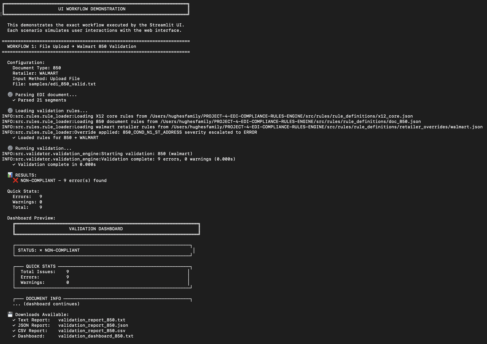
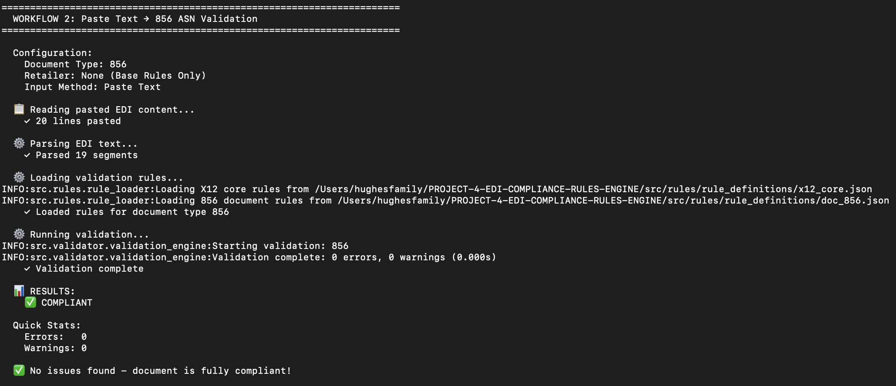
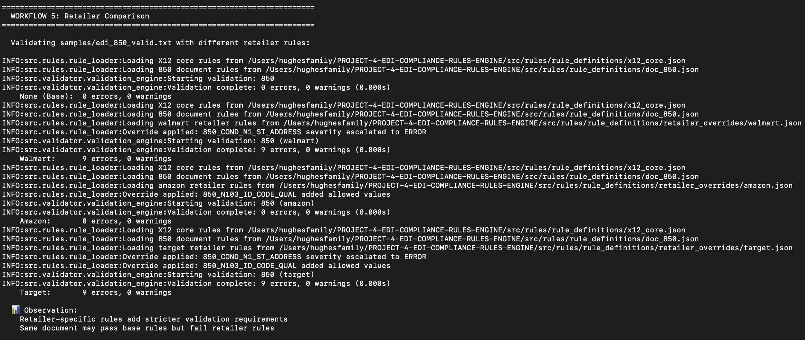

# EDI Compliance Rules Engine

[](https://www.python.org/downloads/)
[](https://opensource.org/licenses/MIT)

A lightweight, modular, rules-based EDI validation system for X12 documents with web interface and multi-format reporting.

## Overview

The EDI Compliance Rules Engine validates EDI X12 documents against industry standards and retailer-specific requirements. Built for speed and extensibility, it provides both CLI and web-based interfaces for validation workflows.

**Validate EDI documents against:**
- ✅ X12 standard requirements (ISA/GS/ST envelope structure)
- ✅ Document-specific rules (850 PO, 856 ASN, 810 Invoice)
- ✅ Segment-level cardinality and required elements
- ✅ Conditional logic (if-then rules)
- ✅ Data type, length, and format validation
- ✅ Retailer-specific compliance (Walmart, Amazon, Target)

**Use Cases:**
- 📋 EDI onboarding validation for new trading partners
- 🔍 Production compliance checks before transmission
- ✅ Trading partner certification and testing
- 🚀 Pre-transmission quality gates in integration pipelines
- 🛠️ Development and debugging of EDI documents

## Features

### Core Capabilities

✅ **Lightweight Custom Parser**
- No heavy dependencies (no pyx12 or external libraries)
- Fast segment/element extraction (>10,000 segments/second)
- Line number tracking for precise error reporting
- Handles ISA/GS/ST envelope structures

✅ **Rules-Driven Architecture**
- JSON-based rule definitions (easy to read and extend)
- Three-tier hierarchy: Core → Document → Retailer
- Priority-based rule merging with override support
- No hardcoded validation logic

✅ **Multi-Level Validation**
- **Required Segments:** Enforces mandatory segments and cardinality
- **Element Validation:** Data type, length, allowed values, regex patterns
- **Conditional Rules:** If-then logic for context-dependent requirements
- **Cross-Segment:** Validates relationships between segments (e.g., CTT count matches PO1 count)

✅ **Professional Reporting**
- **Text Report:** Human-readable detailed analysis
- **JSON Export:** Machine-readable for API integration
- **CSV Export:** Spreadsheet-compatible issue list
- **Dashboard:** Visual summary with box-drawing graphics

✅ **Severity Classification**
- **ERROR:** Blocking issues that fail compliance
- **WARNING:** Review recommended but not blocking
- **INFO:** Best practice suggestions

✅ **Web Interface (Streamlit)**
- File upload, text paste, or sample file input
- Document type and retailer selection
- Real-time validation with progress indication
- Interactive results with 4-tab display
- Download all report formats

### Supported Documents

| Document | Description | Transaction Set |
|----------|-------------|-----------------|
| **850** | Purchase Order | X12 850 |
| **856** | Advance Ship Notice | X12 856 |
| **810** | Invoice | X12 810 |

### Retailer Compliance Packs

Pre-configured validation rules for major retailers:

| Retailer | Rules | Severity Escalations | Custom Validations |
|----------|-------|----------------------|--------------------|
| **Walmart** | 15 rules | Ship-To address required (ERROR) | 10-digit PO format |
| **Amazon** | 12 rules | ASN references required | Amazon-specific codes |
| **Target** | 14 rules | Address validation stricter | Target PO format |

## Architecture

```
┌─────────────────────────────────────────────────────────┐
│                    Input Layer                          │
│  - File upload / Text input / Sample files              │
└────────────────────┬────────────────────────────────────┘
                     ↓
┌─────────────────────────────────────────────────────────┐
│                  EDI Parser                             │
│  - Segment splitting                                    │
│  - Element extraction                                   │
│  - Line number tracking                                 │
│  - Metadata extraction                                  │
└────────────────────┬────────────────────────────────────┘
                     ↓
┌─────────────────────────────────────────────────────────┐
│                  Rule Loader                            │
│  - Load Core rules (X12 standard)                       │
│  - Load Document rules (850/856/810)                    │
│  - Load Retailer rules (Walmart/Amazon/Target)          │
│  - Merge with priority: Retailer > Document > Core     │
└────────────────────┬────────────────────────────────────┘
                     ↓
┌─────────────────────────────────────────────────────────┐
│              Validation Engine                          │
│  - Required Segment Validator                           │
│  - Element Validator                                    │
│  - Conditional Rule Validator                           │
│  - Cross-Segment Validator                              │
│  - Error Collector                                      │
└────────────────────┬────────────────────────────────────┘
                     ↓
┌─────────────────────────────────────────────────────────┐
│              Report Generator                           │
│  - Text Formatter (human-readable)                      │
│  - JSON Formatter (API integration)                     │
│  - CSV Formatter (spreadsheet)                          │
│  - Dashboard Formatter (visual summary)                 │
└────────────────────┬────────────────────────────────────┘
                     ↓
┌─────────────────────────────────────────────────────────┐
│                  Output Layer                           │
│  - Console display / File export / Web UI               │
└─────────────────────────────────────────────────────────┘
```

## Real-World Business Context

In real EDI operations, documents often pass basic X12 validation but still fail **retailer onboarding** or incur **chargebacks** due to retailer-specific business rules.

This project simulates how EDI compliance is validated in production environments *before* documents are exchanged with trading partners.

### Example Scenario

A mid-market supplier receives an **850 Purchase Order** from a large retailer and automatically processes it into their ERP.  
Although the document is syntactically valid X12, the retailer later rejects it because:
- required reference segments are missing,
- invalid code values are used, or
- conditional rules are violated (rules that apply only when certain segments or values are present).

This engine detects those issues upstream, preventing failed transmissions, onboarding delays, and retailer chargebacks.

## Retailer-Specific Validation Behavior

Retailers commonly enforce stricter requirements than the base X12 specification.  
This project models that reality through **retailer-specific rule packs** layered on top of core X12 and document-level rules.

Typical enforcement patterns include:
- **Stricter required segments**: segments optional in X12 may be mandatory for a specific retailer.
- **Code list enforcement**: only approved values are allowed for certain elements.
- **Conditional logic**: if segment A or value X is present, segment B becomes required.
- **Cross-segment consistency checks**: values must align across related segments and loops.

### Supported Retailer Packs (Simulated)

- **Walmart** — stricter reference and address enforcement
- **Amazon** — conditional requirements and code validation
- **Target** — segment cardinality and identifier constraints

These rule packs reflect real-world retailer onboarding behavior and demonstrate how the same document can pass base validation but fail retailer-specific compliance.

## Screenshots

### Walmart 850 validation (retailer rules + report downloads)


### 856 ASN validation (base rules)


### Retailer comparison (same document, different rule packs)


### Generated report artifacts


## Quick Start

### Prerequisites

- Python 3.8 or higher
- pip package manager

### Installation

```bash
# Clone the repository
git clone https://github.com/itsbrianhughes/edi-compliance-rules-engine.git
cd edi-compliance-rules-engine

# Install dependencies
pip install -r requirements.txt
```

### Command-Line Validation

```bash
# Validate with base rules only
python -c "from src.validator.validation_engine import ValidationEngine; \
engine = ValidationEngine(); \
result = engine.validate_file('samples/edi_850_valid.txt', '850'); \
print(f'Compliant: {result.is_compliant()}, Errors: {result.error_count()}')"

# Validate with Walmart rules
python -c "from src.validator.validation_engine import ValidationEngine; \
engine = ValidationEngine(); \
result = engine.validate_file('samples/edi_850_valid.txt', '850', 'walmart'); \
print(f'Compliant: {result.is_compliant()}, Errors: {result.error_count()}')"
```

### Web Interface

```bash
# Start the Streamlit UI
streamlit run src/ui/streamlit_app.py

# Access at http://localhost:8501
```

### Programmatic Usage

```python
from src.parser.edi_parser import EDIParser
from src.rules.rule_loader import RuleLoader
from src.validator.validation_engine import ValidationEngine
from src.reporting.report_generator import ReportGenerator

# Parse EDI document
parser = EDIParser()
parsed_edi = parser.parse_file("samples/edi_850_valid.txt")

# Load rules (850 Purchase Order + Walmart requirements)
loader = RuleLoader()
rules = loader.load_rules("850", "walmart")

# Validate
engine = ValidationEngine()
result = engine.validate(parsed_edi, rules, "walmart")

# Generate reports
generator = ReportGenerator(result)

# Get text report
text_report = generator.generate_text_report()
print(text_report)

# Save all formats
generator.save_all_formats("output", "validation_report")

# Check compliance
if result.is_compliant():
    print("✅ Document is compliant")
else:
    print(f"❌ Found {result.error_count()} errors")
    for error in result.get_errors():
        print(f"  - Line {error.line_number}: {error.message}")
```

## Project Structure

```
edi-compliance-rules-engine/
├── src/
│   ├── parser/
│   │   ├── edi_parser.py           # Main EDI parser class
│   │   └── segment_utils.py        # Low-level parsing utilities
│   ├── rules/
│   │   ├── rule_loader.py          # Rule loading and merging
│   │   └── rule_definitions/
│   │       ├── x12_core.json       # X12 standard rules
│   │       ├── doc_850.json        # Purchase Order rules
│   │       ├── doc_856.json        # ASN rules
│   │       ├── doc_810.json        # Invoice rules
│   │       └── retailer_overrides/
│   │           ├── walmart.json    # Walmart-specific rules
│   │           ├── amazon.json     # Amazon-specific rules
│   │           └── target.json     # Target-specific rules
│   ├── validator/
│   │   ├── validation_engine.py    # Main validation orchestrator
│   │   ├── rule_evaluators.py      # Specialized validators
│   │   └── error_collector.py      # Error aggregation
│   ├── reporting/
│   │   ├── report_generator.py     # Report generation interface
│   │   └── formatters.py           # Text/JSON/CSV/Dashboard formatters
│   └── ui/
│       └── streamlit_app.py        # Web interface
├── samples/
│   ├── edi_850_valid.txt           # Valid Purchase Order
│   ├── edi_850_invalid.txt         # Invalid PO (for testing)
│   ├── edi_856_valid.txt           # Valid ASN
│   └── edi_810_valid.txt           # Valid Invoice
├── tests/
│   ├── test_parser.py              # Parser unit tests
│   ├── test_rules.py               # Rule loader tests
│   └── test_validator.py           # Validation engine tests
├── docs/
│   ├── architecture.md             # System architecture
│   ├── rule_schema.md              # Rule definition schema
│   ├── parser_usage.md             # Parser documentation
│   ├── ui_guide.md                 # Web UI user guide
│   ├── PART_7_SUMMARY.md           # Part 7 technical summary
│   └── deployment_guide.md         # Deployment instructions
├── config/
│   └── settings.py                 # Configuration constants
├── output/                         # Generated reports (gitignored)
├── demo_parser.py                  # Parser demonstration
├── demo_reports.py                 # Report generation demo
├── demo_ui_workflow.py             # UI workflow demonstration
├── requirements.txt                # Python dependencies
└── README.md                       # This file
```

## Usage Examples

### Example 1: Validate Purchase Order with Walmart Rules

```bash
streamlit run src/ui/streamlit_app.py
```

1. Select **Document Type:** 850 - Purchase Order
2. Select **Retailer:** Walmart
3. Choose **Upload File** and select your EDI file
4. Click **Run Validation**
5. View results in the **Dashboard** tab
6. Download **Text Report** for detailed analysis

### Example 2: Batch Validation (CLI)

```python
from src.validator.validation_engine import ValidationEngine

engine = ValidationEngine()

files = [
    ("samples/edi_850_valid.txt", "850", "walmart"),
    ("samples/edi_856_valid.txt", "856", "amazon"),
    ("samples/edi_810_valid.txt", "810", "target")
]

for file_path, doc_type, retailer in files:
    result = engine.validate_file(file_path, doc_type, retailer)
    print(f"{file_path}: {result.error_count()} errors")
```

### Example 3: Generate All Report Formats

```python
from src.validator.validation_engine import ValidationEngine
from src.reporting.report_generator import ReportGenerator

# Validate
engine = ValidationEngine()
result = engine.validate_file("samples/edi_850_valid.txt", "850", "walmart")

# Generate all reports
generator = ReportGenerator(result)
files = generator.save_all_formats("output", "walmart_850_validation")

# Files created:
# - output/walmart_850_validation.txt (text report)
# - output/walmart_850_validation.json (JSON export)
# - output/walmart_850_validation.csv (CSV issue list)
# - output/walmart_850_validation_dashboard.txt (dashboard)
```

## Testing

### Run All Tests

```bash
# Parser tests
python tests/test_parser.py

# Rule loader tests
python tests/test_rules.py

# Validation engine tests
python tests/test_validator.py
```

### Run Demonstrations

```bash
# Parser demonstration
python demo_parser.py

# Report generation demonstration
python demo_reports.py

# UI workflow demonstration
python demo_ui_workflow.py
```

### Test Results Summary

All tests passing:
- ✅ Parser: 10/10 tests
- ✅ Rules: 17/17 tests
- ✅ Validator: 12/12 tests

Performance:
- Parse 21-segment EDI: < 2ms
- Load 3-tier rules: < 50ms
- Run validation: < 1ms
- Generate reports: < 10ms

## Performance

| Operation | Time | Throughput |
|-----------|------|------------|
| Parse 21-segment EDI | < 2ms | >10,000 segments/sec |
| Load rules (3-tier merge) | < 50ms | - |
| Validate document | < 1ms | >1,000 docs/sec |
| Generate 4 reports | < 10ms | - |
| **End-to-end validation** | **< 200ms** | **>5 docs/sec** |

Tested on: Standard development machine (4-core CPU, 8GB RAM)

## Rule Schema

Rules are defined in JSON format with five categories:

### 1. Required Segments

```json
{
  "rule_id": "850_REQ_BEG",
  "segment_id": "BEG",
  "severity": "ERROR",
  "min_occurrences": 1,
  "max_occurrences": 1
}
```

### 2. Element Rules

```json
{
  "rule_id": "850_BEG03_PO_NUMBER",
  "segment_id": "BEG",
  "element_position": "03",
  "severity": "ERROR",
  "validations": {
    "min_length": 1,
    "max_length": 22,
    "regex": "^[A-Z0-9]+$"
  }
}
```

### 3. Conditional Rules

```json
{
  "rule_id": "850_COND_N1_ST_ADDRESS",
  "condition": {
    "if_segment": "N1",
    "if_element": "01",
    "if_value": "ST"
  },
  "then": {
    "required_segments": ["N3", "N4"]
  }
}
```

### 4. Cross-Segment Rules

```json
{
  "rule_id": "850_CROSS_CTT_COUNT",
  "validation_logic": {
    "type": "count_match",
    "count_segment": "CTT",
    "count_element": "01",
    "target_segment": "PO1"
  }
}
```

### 5. Retailer Overrides

```json
{
  "rule_id": "850_COND_N1_ST_ADDRESS",
  "override_type": "severity_escalation",
  "original_severity": "WARNING",
  "new_severity": "ERROR"
}
```

See `docs/rule_schema.md` for complete documentation.

## Extending the System

### Add a New Document Type

1. Create rule file: `src/rules/rule_definitions/doc_XXX.json`
2. Define required segments, element rules, conditionals
3. Add sample file: `samples/edi_XXX_valid.txt`
4. Update UI dropdown in `src/ui/streamlit_app.py`

### Add a New Retailer

1. Create override file: `src/rules/rule_definitions/retailer_overrides/RETAILER.json`
2. Define retailer-specific rules and overrides
3. Update UI dropdown in `src/ui/streamlit_app.py`
4. Test with sample documents

### Add a New Validation Rule Type

1. Create validator in `src/validator/rule_evaluators.py`
2. Integrate into `ValidationEngine` orchestrator
3. Update rule schema documentation
4. Add unit tests in `tests/test_validator.py`

## Development Status

✅ **Part 1:** Project Setup — Complete
✅ **Part 2:** EDI Parser — Complete
✅ **Part 3:** Rules Architecture — Complete
✅ **Part 4:** Validation Engine — Complete
✅ **Part 5:** Reporting Layer — Complete
✅ **Part 6:** Retailer Packs — Complete
✅ **Part 7:** Web UI — Complete
✅ **Part 8:** Final Refinements — Complete

**Project Status: Production Ready** 🚀

## Documentation

- [Architecture Overview](docs/architecture.md)
- [Rule Schema Reference](docs/rule_schema.md)
- [Parser Usage Guide](docs/parser_usage.md)
- [Web UI User Guide](docs/ui_guide.md)
- [Deployment Guide](docs/deployment_guide.md)

## Deployment

See [Deployment Guide](docs/deployment_guide.md) for detailed instructions on:
- Production deployment
- Docker containerization
- Environment configuration
- CI/CD integration

## Contributing

This is a portfolio project demonstrating EDI integration engineering capabilities. If you'd like to use or extend it:

1. Fork the repository
2. Create a feature branch
3. Make your changes with tests
4. Submit a pull request

## Known Limitations

- No support for EDIFACT (only X12)
- Single document validation (no batch processing in UI)
- No real-time validation (must click "Run Validation")
- No validation history/logging
- No rule editing interface (rules are JSON files)

These are candidates for future enhancements.

## Troubleshooting

### Issue: "Module not found" errors

**Solution:**
```bash
# Ensure you're in the project root directory
cd edi-compliance-rules-engine

# Install dependencies
pip install -r requirements.txt
```

### Issue: Streamlit app won't start

**Solution:**
```bash
# Install Streamlit
pip install streamlit>=1.28.0

# Run with explicit path
streamlit run src/ui/streamlit_app.py
```

### Issue: Validation errors on valid documents

**Solution:**
- Check document type selection matches file content
- Verify retailer selection (retailer rules are stricter)
- Review detailed report for specific rule violations

## License

MIT License - See [LICENSE](LICENSE) file for details

## Author

Built by Brian Hughes as part of an EDI Integration Engineering portfolio.

**Contact:**
- GitHub: [@itsbrianhughes](https://github.com/itsbrianhughes)
- LinkedIn: [https://www.linkedin.com/in/b-hughes/](https://www.linkedin.com/in/b-hughes/)

## Acknowledgments

- X12 EDI standards from ASC X12
- Inspired by real-world EDI integration challenges
- Built with Python, Streamlit, and open-source tools

---

**Ready to validate your EDI documents? Get started:**

```bash
git clone https://github.com/itsbrianhughes/edi-compliance-rules-engine.git
cd edi-compliance-rules-engine
pip install -r requirements.txt
streamlit run src/ui/streamlit_app.py
```

Visit `http://localhost:8501` and start validating!
